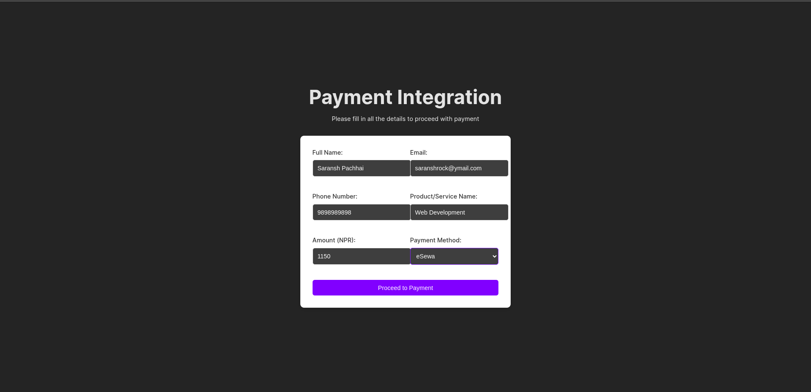
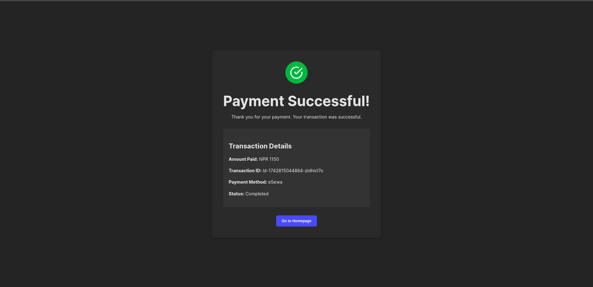
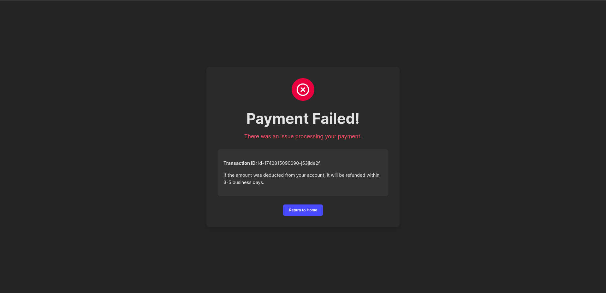

# Payment Gateway Integration (eSewa & Khalti)

A complete payment integration solution with eSewa and Khalti payment gateways for Nepali payment processing.

## Features

- Integration with both eSewa and Khalti payment gateways
- Customer information collection
- Transaction tracking in MongoDB
- Success/Failure handling with proper UI
- Test credentials for development

## Technologies Used

- **Frontend**: React.js
- **Backend**: Node.js, Express.js
- **Database**: MongoDB
- **Payment Gateways**: eSewa, Khalti

## Getting Started

### Installation

1. Clone the repository:

   ```bash
   git clone https://github.com/saransh619/payment-integration.git
   cd payment-integration
   ```

2. Install the dependencies:

   ```bash
   cd client
   npm install
   ```

   ```bash
   cd server
   npm install
   ```

3. Create a .env file in the server directory based on .env.example

4. Running the Application:
   ```bash
   cd client
   npm run dev
   ```
   ```bash
   cd server
   npm run dev
   ```

## Test Credentials

### eSewa Test Credentials:

- Merchant ID/Service Code: EPAYTEST
- Secret Key: 8gBm/:&EnhH.1/q
- Test User Accounts:
  - eSewa ID: 9806800001/2/3/4/5
  - Password: Nepal@123
  - Token: 123456

### Khalti Test Credentials:

- Test Khalti IDs: 9800000000 9800000001 9800000002 9800000003 9800000004 9800000005
- Test MPIN: 1111
- Test OTP: 987654

## API Endpoints

- POST /api/initiate-payment - Initiate payment process
- POST /api/payment-status - Check payment status

## Screenshots

1. **Payment Form**: The main form to collect customer information and payment details.

   

2. **Payment Success**: Displayed after successful payment.

   

3. **Payment Failure**: Displayed when payment fails.

   

## Contributing

Contributions are welcome! Please fork the repository and create a pull request with your changes.
